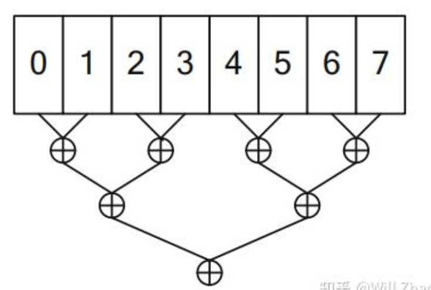
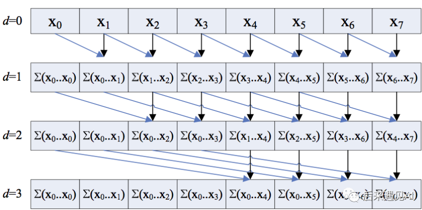
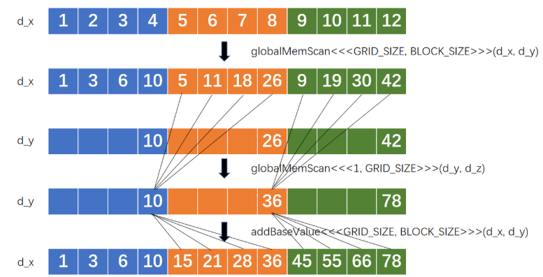

### 课程内容 （拓展版本）
两个经典算法
#### 规约
将串行计算改成并行计算，我们考虑序列相加场景。
##### 串行
```c++
__global__ void SerialKernel(const float* input, float* output, size_t n) {
  float sum = 0.0f;
  for (size_t i = 0; i < n; ++i) {
    sum += input[i];
  }
  *output = sum;
}
```
运行时间：100307us
##### 两阶段并行规约（朴素）

我们把n均分为m个part，第一步启动m个block计算每个part的reduce结果，第二步启动一个单独的block汇总每个part的结果得到最终结果。其中每个block内部再把其负责的部分均分到每个线程，这样就可以得到一个朴素的代码如下
```C++
__global__ void TwoPassSimpleKernel(const float* input, float* part_sum,
                                    size_t n) {
  // n 是要处理的数据总数 (thread —> block -> grid)
  // n / gridDim.x 是每一个block要处理的数据总数
  size_t blk_begin = n / gridDim.x * blockIdx.x;
  size_t blk_end = n / gridDim.x * (blockIdx.x + 1);
  
  n = blk_end - blk_begin; // 此时n变成data per block
  input += blk_begin; 
  part_sum += blockIdx.x;
  
  // data per thread
  size_t thr_begin = n / blockDim.x * threadIdx.x;
  size_t thr_end = n / blockDim.x * (threadIdx.x + 1);
  float thr_sum = 0.0f;
  for (size_t i = thr_begin; i < thr_end; ++i) {
    thr_sum += input[i];
  }

  extern __shared__ float shm[];
  shm[threadIdx.x] = thr_sum;
  __syncthreads();
  // reduce shm to part_sum
  if (threadIdx.x == 0) {
    float sum = 0.0f;
    for (size_t i = 0; i < blockDim.x; ++i) {
      sum += shm[i];
    }
    *part_sum = sum;
  }
}
void ReduceByTwoPass(const float* input, float* part_sum, float* sum,
                     size_t n) {
  const int32_t thread_num_per_block = 1024;  // tuned
  const int32_t block_num = 1024;             // tuned
  // the first pass reduce input[0:n] to part[0:block_num]
  // part_sum[i] stands for the result of i-th block
  size_t shm_size = thread_num_per_block * sizeof(float);  // float per thread
  TwoPassSimpleKernel<<<block_num, thread_num_per_block, shm_size>>>(input,
                                                                     part, n);
  // the second pass reduce part[0:block_num] to output
  TwoPassSimpleKernel<<<1, thread_num_per_block, shm_size>>>(part, output,
                                                             block_num);
}
```
但是不符合GPU架构，IO浪费时间可以优化。打个比方，假设我们有9个数，使用3个线程去做局部reduce, 0号线程处理第0,1,2的数，1号线程处理第3,4,5的数，而第三个线程处理第6,7,8的数。于是有如下表
| | 时刻0 | 时刻1 | 时刻2 |
| :--- | :---: | :---: | :---: |
| 线程0 | 0 | 1 | 2 |
| 线程1 | 3 | 4 | 5 |
| 线程2 | 6 | 7 | 8 |
在每一个时刻下存取的内存地址不连续。，我们想要将表中数据变成
| | 时刻0 | 时刻1 | 时刻2 |
| :--- | :---: | :---: | :---: |
| 线程0 | 0 | 3 | 6 |
| 线程1 | 1 | 4 | 7 |
| 线程2 | 2 | 5 | 8 |
##### 两阶段并行规约（优化内存读取）
```c++
__global__ void TwoPassInterleavedKernel(const float* input, float* part_sum,
                                         size_t n) {
  int32_t gtid = blockIdx.x * blockDim.x + threadIdx.x;  // global thread index
  int32_t total_thread_num = gridDim.x * blockDim.x;
  // reduce
  //   input[gtid + total_thread_num * 0]
  //   input[gtid + total_thread_num * 1]
  //   input[gtid + total_thread_num * 2]
  //   input[gtid + total_thread_num * ...]
  float sum = 0.0f;
  for (int32_t i = gtid; i < n; i += total_thread_num) {
    sum += input[i];
  }
  // store sum to shared memory
  extern __shared__ float shm[];
  shm[threadIdx.x] = sum;
  __syncthreads();
  // reduce shm to part_sum
  if (threadIdx.x == 0) {
    float sum = 0.0f;
    for (size_t i = 0; i < blockDim.x; ++i) {
      sum += shm[i];
    }
    part_sum[blockIdx.x] = sum;
  }
}
```
我们发现最后一个for循环中是单线程的，我们可以采用多线程完成
修改for为
```c++
for (int32_t active_thread_num = blockDim.x / 2; active_thread_num >= 1;
       active_thread_num /= 2) {
    if (threadIdx.x < active_thread_num) {
      shm[threadIdx.x] += shm[threadIdx.x + active_thread_num];
    }
    __syncthreads();
  }
  if (threadIdx.x == 0) {
    part_sum[blockIdx.x] = shm[0];
  }
```
当最后一个block完成第一阶段规约后立即用当前block完成第二阶段规约可减少少量运行时间。
**重点在两个for循环编写**
#### 扫描 （前缀和）
##### CPU版
```c++
void PrefixSum(const int32_t* input, size_t n, int32_t* output) {
  int32_t sum = 0;
  for (size_t i = 0; i < n; ++i) {
    sum += input[i];
    output[i] = sum;
  }
}
```
##### Hillis Steele Scan（并行前缀扫描算法）

```c++
__global__ void globalMemScan(real *d_x, real *d_y) {
    real *x = d_x + blockDim.x * blockIdx.x;
    const int n = blockDim.x * blockIdx.x + threadIdx.x;
    real y = 0.0;
    if (n < N) {
        for (int offset = 1; offset < blockDim.x; offset <<= 1) {
            if (threadIdx.x >= offset) y = x[threadIdx.x] + x[threadIdx.x - offset];
            __syncthreads();
            if (threadIdx.x >= offset) x[threadIdx.x] = y;
        }
        if (threadIdx.x == blockDim.x - 1) d_y[blockIdx.x] = x[threadIdx.x];
    } 
}

__global__ void addBaseValue(real *d_x, real *d_y) {
    const int n = blockDim.x * blockIdx.x + threadIdx.x;
    real y = blockIdx.x > 0 ? d_y[blockIdx.x - 1] : 0.0;
    if (n < N) {
        d_x[n] += y;
    } 
}
```
主要过程

使用共享内存优化
```c++
__global__ void sharedMemScan(real *d_x, real *d_y) {
    extern __shared__ real s_x[];
    const int n = blockDim.x * blockIdx.x + threadIdx.x;
    s_x[threadIdx.x] = n < N ? d_x[n] : 0.0;
    __syncthreads();
    real y = 0.0;
    if (n < N) {
        for (int offset = 1; offset < blockDim.x; offset <<= 1) {
            if (threadIdx.x >= offset) y = s_x[threadIdx.x] + s_x[threadIdx.x - offset];
            __syncthreads();
            if (threadIdx.x >= offset) s_x[threadIdx.x] = y;
        }
        d_x[n] = s_x[threadIdx.x];
        if (threadIdx.x == blockDim.x - 1) d_y[blockIdx.x] = s_x[threadIdx.x];
    } 
}
```
**重点还是在for循环编写**
##### 使用thrust库
```c++
#include <thrust/scan.h>
#include <thrust/execution_policy.h>

thrust::inclusive_scan(thrust::device, d_x, d_x + N, d_x);
```
thrust 通常接近理论最优
### 作业 色调映射
#### 需求： 
真实世界白和黑的色差比现实世界中白和黑差异大很多。我们要将白和黑map到一个合适的区间才不会使得照片过暗或曝光。
#### **核心解答：为什么CDF能实现有效的色调映射？**

简而言之，**CDF提供了一种“智能”的、非线性的压缩方法，它根据像素的分布情况来重新分配亮度值。**

让我们分解一下这个逻辑：

##### 1. 问题的根源：线性映射-失败

背景资料里解释得很清楚：HDR图像的亮度范围可能从0到275，但98%的像素值都小于3。

*   **如果线性映射**：你把 `[0, 275]` 这个范围等比例地缩放到 `[0, 255]`。
    *   一个亮度为 `3` 的像素，新值会是 `(3 / 275) * 255 ≈ 2.8`，取整后是 `2` 或 `3`。
    *   一个亮度为 `0.5` 的像素，新值会是 `(0.5 / 275) * 255 ≈ 0.46`，取整后是 `0`。
*   **结果**：那98%的像素，它们原始亮度的微小差异（比如0.5和3的区别）在映射后几乎全被压缩到了`0`、`1`、`2`这几个最暗的值里。你看上去就是一片漆黑，只有原来最亮的窗户（比如亮度200+）才能被看见。

##### 2. 解决方案：基于数据分布的非线性映射

我们不希望一视同仁地压缩所有亮度。我们希望：
*   **对于像素密集的区域（大部分暗部细节）**：我们想把这个区域的对比度“拉伸”开，让微小的亮度差异变得可见。
*   **对于像素稀疏的区域（少数极亮的点）**：我们可以把这个区域的对比度“压缩”一下，因为我们不太关心亮度200和250之间的具体区别，只要知道它们都很亮就行。

**直方图和CDF恰好能完美实现这一点！**

##### 3. 直方图和CDF如何工作

*   **第1步：直方图（Histogram）**
    *   直方图告诉我们：“哪个亮度范围内的像素最多？”
    *   在我们的例子中，直方图会显示，绝大多数像素都集中在低亮度值的bin里。

*   **第2步：累积分布函数（CDF）**
    *   CDF是通过对直方图做前缀和（prefix sum）得到的。`CDF[i]` 的值等于“亮度小于等于第 `i` 个桶的所有像素的总数”。
    *   **CDF有一个神奇的特性：它的斜率正比于直方图的高度。**
        *   在像素**密集**的区域（如暗部），直方图很高，所以CDF曲线**非常陡峭**。
        *   在像素**稀疏**的区域（如亮部），直方图很低，所以CDF曲线**非常平缓**。

*   **第3步：使用CDF进行映射**
    *   现在，我们用一个像素的CDF值（除以总像素数，将其归一化到 [0, 1]）作为它的**新亮度值**。
    *   **看发生了什么：**
        *   **在暗部区域**：因为CDF曲线很陡，原始亮度值一个微小的变化（例如从0.5到1.0），会导致其CDF值（新亮度）有一个**巨大**的变化。这就相当于“拉伸”了暗部的对比度！
        *   **在亮部区域**：因为CDF曲线很平缓，原始亮度值一个巨大的变化（例如从100到200），其CDF值（新亮度）只会有一个**微小**的变化。这就相当于“压缩”了亮部的范围！

#### **举例说明**

回到作业中的例子：
*   `input : [2 4 3 3 1 7 4 5 7 0 9 4 3 2]` (共14个像素)
*   `histo with 3 bins: [4 7 3]`
    *   Bin 0 (暗): 4个像素
    *   Bin 1 (中): 7个像素
    *   Bin 2 (亮): 3个像素
*   `cdf : [4 11 14]`

现在我们用CDF来映射：
*   一个在 **Bin 0** (暗部) 的像素，它的新亮度值将正比于 `CDF[0] / 14 = 4/14 ≈ 0.28`。
*   一个在 **Bin 1** (中部) 的像素，它的新亮度值将正比于 `CDF[1] / 14 = 11/14 ≈ 0.78`。
*   一个在 **Bin 2** (亮部) 的像素，它的新亮度值将正比于 `CDF[2] / 14 = 14/14 = 1.0`。

你看，像素最密集的中部区域（Bin 1），在新的亮度空间里占据了从 `0.28` 到 `0.78` 的巨大范围。而像素较少的亮部和暗部，占据的范围相对较小。这就实现了我们想要的“智能压缩”。

#### 作业代码：
##### 第一步：找到输入通道的最大值和最小值，利用规约增大并行计算
```c++
// 核函数 1: 部分归约
// 每个线程块将输入数组的一大块归约为一个 min/max 对
__global__ void min_max_partial_reduction_kernel(const float *const input, float2 *partial_results, const size_t numPixels)
{
   // 为这个块的 min/max 值分配共享内存
   extern __shared__ float s_data[];
   float *s_min = s_data;
   float *s_max = &s_data[blockDim.x];

   const unsigned int tid = threadIdx.x;
   const unsigned int global_idx_start = blockIdx.x * blockDim.x * 2;

   // 初始化线程的局部 min/max
   float local_min = 1e20f;  // A large number
   float local_max = -1e20f; // A small number

   // 每个线程处理两个元素以增加效率 (strided loop)
   for (unsigned int i = global_idx_start + tid; i < numPixels; i += blockDim.x * 2)
   {
      float val1 = input[i];
      local_min = fminf(local_min, val1);
      local_max = fmaxf(local_max, val1);

      if (i + blockDim.x < numPixels)
      {
         float val2 = input[i + blockDim.x];
         local_min = fminf(local_min, val2);
         local_max = fmaxf(local_max, val2);
      }
   }

   s_min[tid] = local_min;
   s_max[tid] = local_max;
   __syncthreads();

   // 在共享内存中进行块内归约
   for (unsigned int s = blockDim.x / 2; s > 0; s >>= 1)
   {
      if (tid < s)
      {
         s_min[tid] = fminf(s_min[tid], s_min[tid + s]);
         s_max[tid] = fmaxf(s_max[tid], s_max[tid + s]);
      }
      __syncthreads();
   }

   // 块的第一个线程将此块的结果写入全局内存
   if (tid == 0)
   {
      partial_results[blockIdx.x].x = s_min[0];
      partial_results[blockIdx.x].y = s_max[0];
   }
}

// 核函数 2: 最终归约
// 使用单个块来归约部分结果，得到最终的 min/max
__global__ void min_max_final_reduction_kernel(float2 *partial_results, const int num_partials)
{
   extern __shared__ float s_data[];
   float *s_min = s_data;
   float *s_max = &s_data[blockDim.x];

   const unsigned int tid = threadIdx.x;

   // 从全局内存加载部分结果到共享内存
   if (tid < num_partials)
   {
      s_min[tid] = partial_results[tid].x;
      s_max[tid] = partial_results[tid].y;
   }
   else
   {
      s_min[tid] = 1e20f;
      s_max[tid] = -1e20f;
   }
   __syncthreads();

   // 在共享内存中进行最终的归约
   for (unsigned int s = blockDim.x / 2; s > 0; s >>= 1)
   {
      if (tid < s)
      {
         s_min[tid] = fminf(s_min[tid], s_min[tid + s]);
         s_max[tid] = fmaxf(s_max[tid], s_max[tid + s]);
      }
      __syncthreads();
   }

   // 第一个线程将最终结果写回全局内存的第一个位置
   if (tid == 0)
   {
      partial_results[0].x = s_min[0];
      partial_results[0].y = s_max[0];
   }
}
```

##### 第二步：形成直方图（原子操作简化版）
```c++
__global__ void histogram_kernel(const float *const logLuminance,
                                 unsigned int *histogram,
                                 float min_logLum,
                                 int numbins,
                                 int numPix,
                                 float LumRange)
{
   int idx = blockDim.x * blockIdx.x + threadIdx.x;

   if (idx < numPix)
   {
      float Lum = logLuminance[idx];

      unsigned int bin = static_cast<unsigned int>(Lum - min_logLum) / LumRange * (numbins - 1.f);
      atomicAdd(&histogram[bin], 1);
   }
}
```
**注意** 上述代码在处理大图片不能胜任！