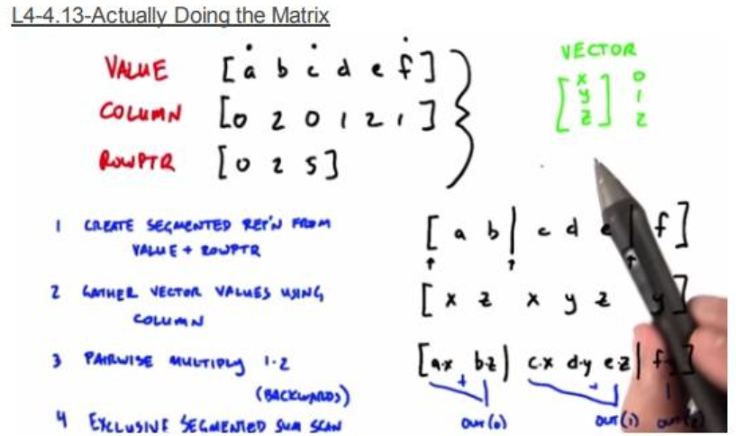
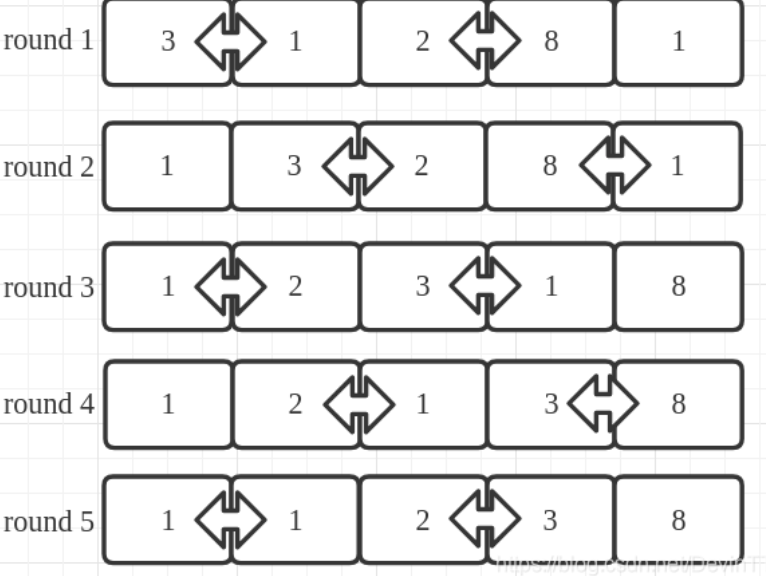

### 课程内容
#### 压缩扫描
压缩的意思是在数据中取出我们想要的数据，例如在基数排序中对某一个bit处理时分开不同的digit会用到。通常配合exclude_scan使用，以便后续分配内存。
示例代码：
```c++
int digit = (val >> bit_shift) & MASK;
unsigned int output_idx = atomicAdd(&d_scanned_hist[digit], 1);
```
#### SPMV（系数矩阵乘法）
利用CSR表示法


#### CUDA排序
##### ODD Even Sort （奇偶排序）
奇数步中， array中奇数项array[i]与右边的item(array[i + 1])比较；
偶数步中， array中奇数项array[i]与左边的item(array[i - 1]) 比较；
> 注意数组开始index = 0是偶数。


```c++
__global__ void cudaOddEvenSort(int* data, __uint32_t len){
    unsigned int idx = blockIdx.x*blockDim.x + threadIdx.x;
    __uint8_t isOdd = 0;
    __uint32_t counter = len;
 
    do{
        isOdd = (++isOdd)%2;
        int d0 = data[isOdd+2*idx];
        if(isOdd+2*idx+1>=len) {continue;}    //边界检查
        int d1 = data[isOdd+2*idx+1];
 
        if(d0>d1) {
            data[isOdd+2*idx] = d1;
            data[isOdd+2*idx+1] = d0;
        }
    }while(counter--);
}
```
主函数调用：
```c++
#include <cuda_runtime.h>
 
#define LEN 127
 
int main(int argc,char **argv) {
 
    int *sortdata ;
    cudaMallocManaged(&sortdata, LEN);
    for(int i=0; i<LEN; i++) sortdata[i]=LEN-i;
    cudaOddEvenSort<<< 1, LEN/2>>>(sortdata, LEN);
    cudaSafeCall(cudaDeviceSynchronize());
    for(int i=0; i<LEN; i++) printf("%d ", sortdata[i]);
    cudaFree(sortdata);
 
    return 0;
}
```
##### merge Sort
CUDA中归并排序分为三个阶段
 - 小规模排序（thread/wrap级别）
 - 块内合并
 - 全局合并

##### 基数排序
基数排序，二进制由低位到高位依次排序。0/1分类就是上面提到的compact操作。

### 作业 消除红眼
拍照时出现“红眼”效应，其根本原因是相机闪光灯的光线射入眼睛，从眼底富含血管的脉络膜反射回来，并被相机镜头捕捉到的结果。
#### 整体思路
 - 分组
 - 计算前缀和 计算互斥前缀
 - 计算目标地址
    *   如果一个元素属于"0组"，它的新位置就是它在"0组"中的排名。这个排名直接由前缀和的结果`d_cdf`给出。
    *   如果一个元素属于"1组"，它的新位置等于它在"1组"中的排名，再加上"0组"的总数量。
 - Scatter： 根据上一步计算出的目标地址，将原始数据从输入数组中读取出来，然后“散布”到输出数组的正确位置上。

#### 划分操作
```c++
__global__ void split_array(unsigned int *d_inputVals, unsigned int *d_splitVals,
                            const size_t numElems, unsigned int mask,
                            unsigned int ibit)
{
  int array_idx = blockIdx.x * blockDim.x + threadIdx.x;
  if (array_idx >= numElems)
    return;

  // 采用反向映射，后续的扫描求和操作就能直接得到“比特位为0”的元素的计数
  d_splitVals[array_idx] = !(d_inputVals[array_idx] & mask);
}
```
#### 并行前缀和
```c++
__global__ void blelloch_scan_single_block(unsigned int *d_in_array,
                                           const size_t numBins,
                                           unsigned normalization = 0)
/*
  Computes the blelloch exclusive scan for a cumulative distribution function of a
  histogram, one block at a time.
  \Params:
    * d_in_array - input array of histogram values in each bin. Gets converted
      to cdf by the end of the function.
    * numBins - number of bins in the histogram (Must be < 2*MAX_THREADS_PER_BLOCK)
    * normalization - constant value to add to all bins
      (when doing full exclusive sum scan over multiple blocks).
*/
{

  int thid = threadIdx.x;

  extern __shared__ float temp_array[];

  // 每个线程负责搬运两个元素
  if (thid < numBins)
    temp_array[thid] = d_in_array[thid];
  else
    temp_array[thid] = 0;
  if ((thid + numBins / 2) < numBins)
    temp_array[thid + numBins / 2] = d_in_array[thid + numBins / 2];
  else
    temp_array[thid + numBins / 2] = 0;

  __syncthreads();

  // Part 1: Up Sweep, reduction
  // Iterate log_2(numBins) times, and each element adds value 'stride'
  // elements away to its own value.
  int stride = 1;
  for (int d = numBins >> 1; d > 0; d >>= 1)
  {

    if (thid < d)
    {
      int neighbor = stride * (2 * thid + 1) - 1; //左子结点
      int index = stride * (2 * thid + 2) - 1; // 右子节点

      temp_array[index] += temp_array[neighbor];
    }
    stride *= 2;
    __syncthreads();
  }
  // Now set last element to identity:
  if (thid == 0)
    temp_array[numBins - 1] = 0;

  // Part 2: Down sweep
  // Iterate log(n) times. Each thread adds value stride elements away to
  // its own value, and sets the value stride elements away to its own
  // previous value.
  for (int d = 1; d < numBins; d *= 2)
  {
    stride >>= 1;
    __syncthreads();

    if (thid < d)
    {
      int neighbor = stride * (2 * thid + 1) - 1;
      int index = stride * (2 * thid + 2) - 1;

      float t = temp_array[neighbor];
      temp_array[neighbor] = temp_array[index];
      temp_array[index] += t;
    }
  }

  __syncthreads();

  if (thid < numBins)
    d_in_array[thid] = temp_array[thid] + normalization;
  if ((thid + numBins / 2) < numBins)
    d_in_array[thid + numBins / 2] = temp_array[thid + numBins / 2] + normalization;
}
```
##### 计算目标地址
```c++
__global__ void compute_outputPos(const unsigned int *d_inputVals,
                                  unsigned int *d_outputVals,
                                  unsigned int *d_outputPos, unsigned int *d_tVals,
                                  const unsigned int *d_splitVals,
                                  const unsigned int *d_cdf, const unsigned int totalFalses,
                                  const unsigned int numElems)
{
    /*
    d_splitVals[global_id]: 当前元素属于"0组"（值为1）还是"1组"（值为0）。
    d_cdf[global_id]: 在当前元素之前，有多少个元素属于"0组"。
    */

  int thid = threadIdx.x;
  int global_id = blockIdx.x * blockDim.x + thid;
  if (global_id >= numElems)
    return;

  d_tVals[global_id] = global_id - d_cdf[global_id] + totalFalses; 

  unsigned int scatter = (!(d_splitVals[global_id]) ? d_tVals[global_id] : d_cdf[global_id]);
  d_outputPos[global_id] = scatter;
}
```
##### 写入Scatter
```c++
__global__ void do_scatter(unsigned int *d_outputVals, const unsigned int *d_inputVals,
                           unsigned int *d_outputPos,
                           unsigned int *d_inputPos,
                           unsigned int *d_scatterAddr,
                           const unsigned int numElems)
{

  int global_id = blockIdx.x * blockDim.x + threadIdx.x;
  if (global_id >= numElems)
    return;

  d_outputVals[d_outputPos[global_id]] = d_inputVals[global_id];
  d_scatterAddr[d_outputPos[global_id]] = d_inputPos[global_id];
}
```